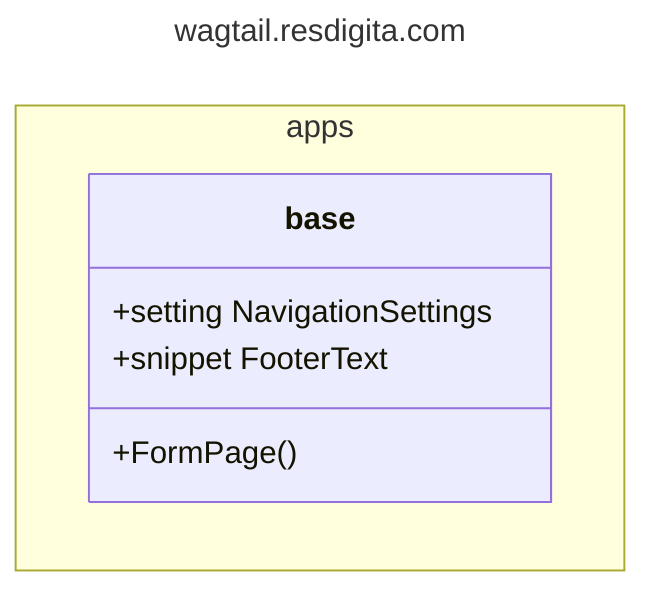

# Application Folder base

This has FormPage, and FormField, but we don't use them. 

It also has NavigationSettings and FooterText, but I don't think we use them.

```mermaid
---
title: wagtail.resdigita.com
---
classDiagram
  
  namespace apps {
    class base {
        +setting NavigationSettings
        +snippet FooterText
        +FormPage()
    }
  
  }
  
```