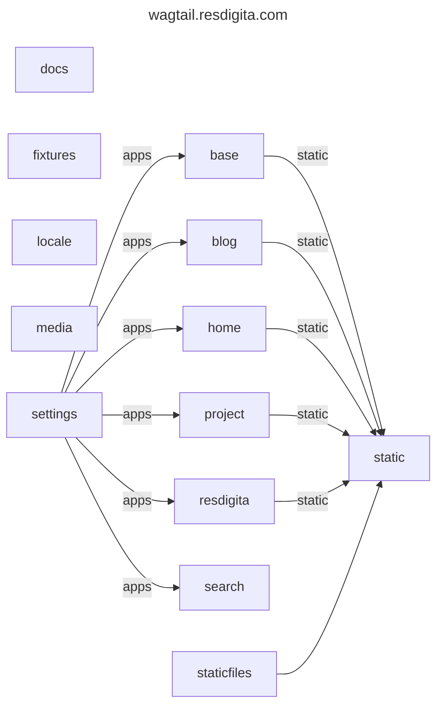

# Folder 'docs'

This has the documentation for wagtail.resdigita.com. See [../README.md](../README.md) for a more concise introduction.

  - [Installation](./installation.md)
  - [Fixtures (mainly initial data for now)](./fixtures.md)
  - [Git (tips on our usage)](./git.md)
  - [Connected](./connected.md)
  - [Architecture and thoughts about workflow](./architecture.md)
  - [Nixos in production](./nixos.md)
  - [Starter template standard documentation](./starter.md)
  - [Starter-news template we are not using](./starter-news.md)

