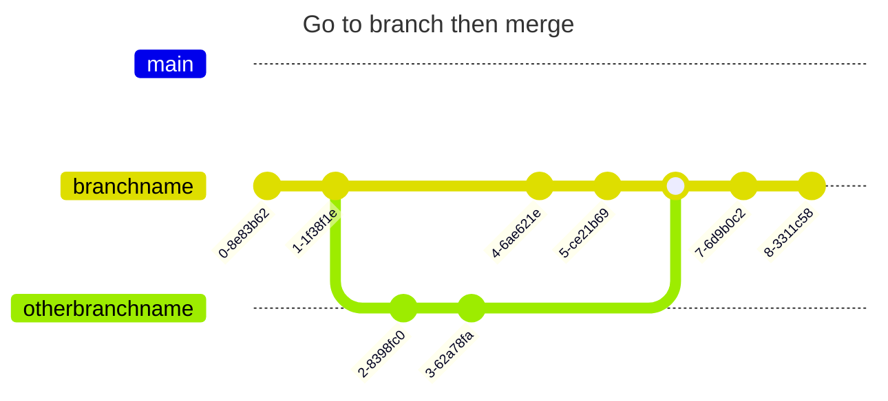

# Notes on git

To check the branches:

`git branch`

To put yourself on a branch

`git checkout branchname`

To pull in changes on another branch to the current branch (a merge, but with git pull)

`git pull origin otherbranchname`

There might be conflicts to resolve and test. If so, `git add *` when done.

After pulling from another branch, don't forget `git push`

## Version ckeck

There may have been desynchornisation of git on different environments. Maybe we should have a version and installation check. 

## Using Pull Requests

I am not really up to speed on this approach. 

## Fancy Drawing (when Markdown rendered)

