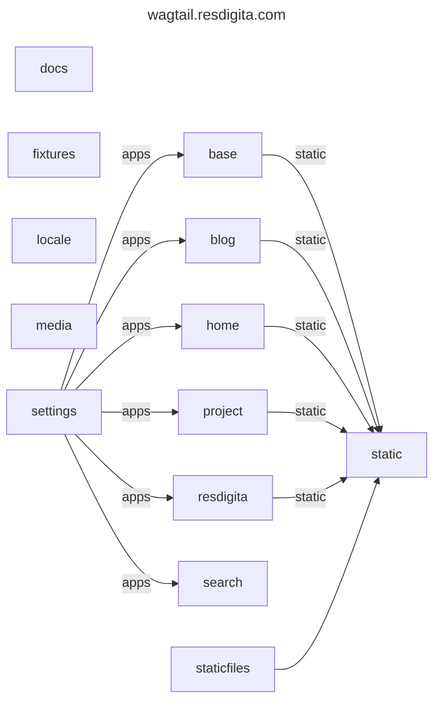
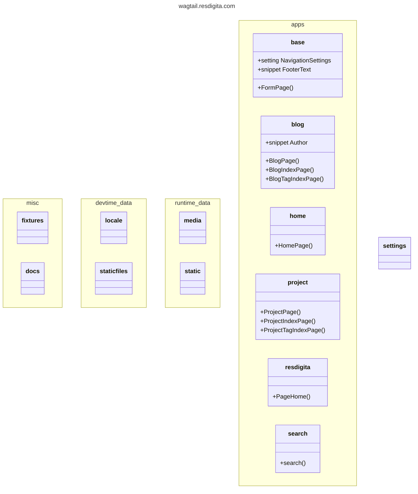

## Wagtail

Here is the stack:

* wagtail
* django
* python

By default, I use the sqlite database engine until we integrate SSO with key.resdigita.com. 

## Folders Diagram

## Class Diagram

## Thoughts about developing strategy

Wagtail, as a Django app, integrates well with vanilla Django. As such, maybe let's develop our custom parts as Django apps without necessarily depending on 
Wagtail as in `resdigita`?

Here is a documentation page from Wagtail showing how to integrate Wagtail into an existing Django app, although our strategy may be to integrate distinct Django apps into Wagtail:

<https://docs.wagtail.org/en/stable/advanced_topics/add_to_django_project.html>

We could then integrate the development into the wagtail site. Just an idea.

The wagtail templates are in `templates/*.html`.

I do use the default setup of `sqlite`.