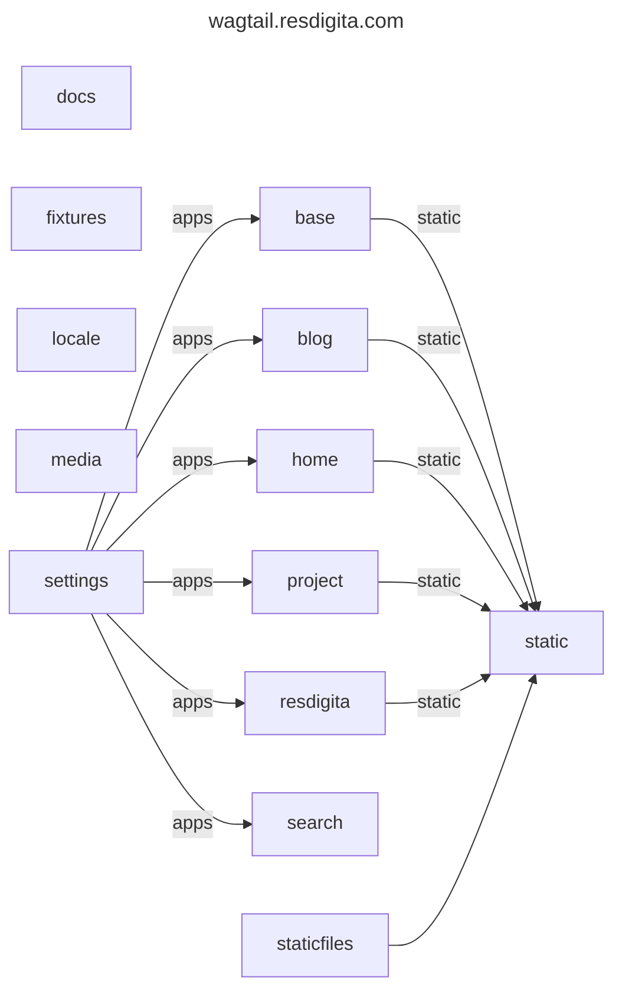

# Folder 'fixtures'

This has the initial data for a test setup.

```mermaid
---
title: wagtail.resdigita.com
---
flowchart LR

base
blog
docs
fixtures
home
locale
media
project
resdigita
search
settings -- apps --> base & blog & home & project & resdigita & search
base & blog & home & project & resdigita -- static --> static
staticfiles --> static
static
staticfiles

```