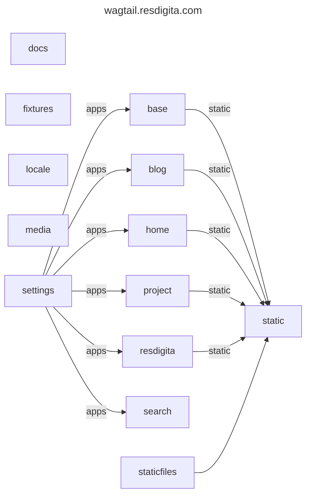

# Folder 'staticfiles'

This folder has static assets that are not in ./resdigita/static/ or in ./*/static/ where ./*/ are the referenced applications. It is an extra folder for static distribution-time files added to the `collectstatic` process. You may overload stuff here used by other apps, I think.

